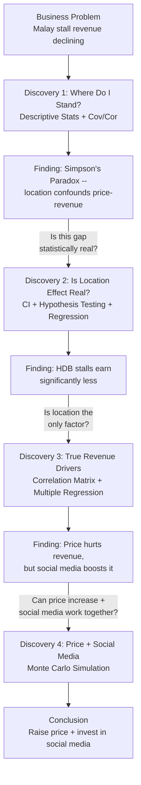

# Hawker Stall Revenue Analysis

A data-driven investigation into hawker stall revenue from the perspective of a Malay food stall owner at an HDB hawker centre in Singapore. The analysis follows a discovery-driven narrative — each finding raises the next question — uncovering a Simpson's Paradox in the price-revenue relationship and resolving it through regression and Monte Carlo simulation to arrive at a combined price increase + social media strategy.

## Research Flow

Each discovery's finding motivates the next question:



## Discoveries

| # | Topic | Key Question | Methods (Course Weeks) |
|---|-------|--------------|----------------------|
| 1 | Where Do I Stand? | How do Malay stalls perform, and does location confound the price-revenue relationship? | Descriptive statistics, histogram, boxplot (Wk 4, 6), covariance and correlation (Wk 5), conditional probability / Simpson's Paradox (Wk 2, 5) |
| 2 | Is the Location Effect Real? | Can we prove statistically that HDB stalls earn less? | 95% CI with t-distribution (Wk 7), one-sample hypothesis test (Wk 8-9), regression with dummy variables (Wk 10) |
| 3 | True Revenue Drivers | After controlling for all factors, what matters most? | Correlation matrix (Wk 5), multiple regression with log transform (Wk 10-11), R-squared (Wk 11), hypothesis tests on coefficients (Wk 8-9) |
| 4 | Price + Social Media | Can a modest price increase paired with social media investment boost net revenue? | Monte Carlo simulation (Wk 12), sampling distribution (Wk 6), confidence intervals from simulation (Wk 7, 12) |

## Dataset

`Hawker Data Statistics.csv` — 220 Malay stall observations with the following variables:

| Variable | Type | Description |
|----------|------|-------------|
| `daily_revenue` | numeric | Daily revenue in SGD |
| `avg_price` | numeric | Average dish price in SGD |
| `location_type` | categorical | CBD, HDB, or Tourist area |
| `competition` | integer | Number of nearby competing stalls |
| `day_type` | categorical | Weekday or Weekend |
| `stall_age` | numeric | Years the stall has been operating |
| `has_social_media` | categorical | Whether the stall uses social media (Yes/No) |
| `social_media_spend` | numeric | Monthly social media marketing spend in SGD |

## Prerequisites

You need **R** and **Jupyter** with an R kernel installed.

### 1. Install R

- **macOS** (Homebrew): `brew install r`
- **Ubuntu/Debian**: `sudo apt install r-base`
- **Windows**: download the installer from [CRAN](https://cran.r-project.org/)

### 2. Install the R kernel for Jupyter

Open an R console and run:

```r
install.packages("IRkernel")
IRkernel::installspec()
```

### 3. Install R packages

The notebook depends on a single extra package. From an R console:

```r
install.packages("e1071")
```

### 4. Install Jupyter

If you don't already have Jupyter:

```bash
pip install jupyterlab
```

## Running the Notebook

```bash
# clone the repo
git clone https://github.com/<your-username>/hawker-data-analysis.git
cd hawker-data-analysis

# launch Jupyter
jupyter lab
```

Open `discovery.ipynb` and run all cells. The notebook reads `Hawker Data Statistics.csv` from the project root, so make sure you launch Jupyter from the repo directory.

## Project Structure

```
hawker-data-analysis/
├── discovery.ipynb              # Main analysis notebook (R kernel)
├── Hawker Data Statistics.csv   # Source dataset (220 Malay stalls)
├── slides/                      # Weekly lecture materials
│   ├── Week 1  – Probability measure
│   ├── Week 2  – Conditional probabilities
│   ├── Week 3  – Random variables
│   ├── Week 4  – Expectation
│   ├── Week 5  – Bivariate distributions & correlations
│   ├── Week 6  – Sampling & statistical inferences
│   ├── Week 7  – Confidence intervals
│   ├── Week 8-9 – Hypothesis testing
│   ├── Week 10 – Regression analysis 1
│   ├── Week 11 – Regression analysis 2
│   └── Week 12 – Simulation analysis
└── README.md
```
